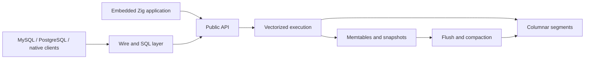

<div align="center">
  
  <h1>thinDB</h1>
  <p><strong>Columnar analytics without the distributed machinery.</strong></p>
  <p>
    A single-node analytics database written in Zig, available as an embedded library
    or a standalone server speaking MySQL, PostgreSQL, and thinDB's native wire protocol.
  </p>
  <p>
    
    
    
  </p>
</div>

---

thinDB is built for analytical work that fits on one machine. It stores data in immutable,
order-key-sorted columnar segments and executes SQL through vectorized operators. The design
stays deliberately small: no coordinator, distributed shuffle, replica protocol, or hidden
cost-based query optimizer.

## Why thinDB

- **Fast analytical core.** Columnar storage, row-group pruning, vectorized execution, SIMD
  kernels, parallel scans, and specialized aggregation paths.
- **Use existing SQL clients.** Connect with MySQL or PostgreSQL drivers, CLIs, and connection
  pools. Both listeners share the same catalog.
- **Embed it or run it.** Import the Zig library directly or launch `thindb-server` as a
  standalone multi-wire process.
- **Extend it in Zig.** Register scalar and aggregate kernels, create typed table functions,
  submit Zig source, or load a compatible prebuilt library.
- **Predictable by design.** Query structure remains visible. thinDB favors bounded physical
  routing over a general runtime optimizer that rewrites user intent.

## Quick start

thinDB currently targets **Zig 0.16**.

```bash
git clone https://github.com/jeremydiviney/thinDB.git
cd thinDB
zig build -Doptimize=ReleaseFast
```

Start the server with a local data directory:

```bash
./zig-out/bin/thindb-server \
  --data-dir ./thindb-data \
  --bind 127.0.0.1
```

On Windows, run `zig-out\bin\thindb-server.exe` with the same flags. The default listeners are:

| Protocol | Port | Connect |
|---|---:|---|
| MySQL | `3306` | `mysql -h 127.0.0.1 -P 3306 -u thindb main__public` |
| PostgreSQL | `5432` | `psql "host=127.0.0.1 port=5432 user=thindb dbname=main"` |
| thinDB native | `7878` | Embedded/native clients |

Set a listener port to `0` to disable it. Local development defaults to trust authentication;
see `thindb-server --help` before exposing a listener beyond loopback.

## First query

Run this through either a MySQL or PostgreSQL connection:

```sql
CREATE TABLE events (
  event_id BIGINT PRIMARY KEY,
  account_id BIGINT NOT NULL,
  occurred_at DATETIME NOT NULL,
  amount DECIMAL(18, 2),
  properties JSON
);

INSERT INTO events VALUES
  (1, 100, '2026-07-10 09:00:00', 29.00, '{"channel":"web"}'),
  (2, 100, '2026-07-10 09:02:00', 49.00, '{"channel":"partner"}');

SELECT
  account_id,
  properties ->> '$.channel' AS channel,
  COUNT(*) AS events,
  SUM(amount) AS revenue
FROM events
GROUP BY account_id, channel
ORDER BY revenue DESC;
```

## What is included

| Area | Current surface |
|---|---|
| Storage | Immutable columnar segments, memtables, WAL, row-group statistics, encodings, compression, tombstones, flush, and compaction |
| SQL | Filters, expressions, grouping, exact aggregates, joins, CTEs, subqueries, windows, sorting, limits, JSON navigation, and file scans |
| Connectivity | MySQL wire, PostgreSQL wire, prepared statements, native wire, and in-process connections |
| Types | Integer widths, floats, decimal, strings, boolean, date, datetime, UUID, and JSON |
| Operations | Per-query and process memory budgets, cache sizing, parallelism controls, diagnostics, and background maintenance |
| Extensibility | Reusable SQL table functions, typed Zig table UDFs, embedded scalar UDFs, and aggregate UDFs |

## Three function models

### Reusable SQL

Package a parameterized `SELECT` and use its result as a table source:

```sql
CREATE FUNCTION orders_for_customer(customer BIGINT)
RETURNS TABLE AS (
  SELECT order_id, ordered_at, total
  FROM orders
  WHERE customer_id = customer
);

SELECT * FROM orders_for_customer(42) ORDER BY ordered_at DESC;
```

### Zig table functions

Define typed `Input` and `Output` row shapes plus a `process` callback. Table functions can
receive partitioned/ordered subqueries, scalar `Args`, and multiple co-grouped input relations.
They can be registered by an embedding application, compiled from submitted Zig source, or
loaded from a compatible prebuilt dynamic library.

```sql
SELECT id, running
FROM TABLE(
  running_total((SELECT id, account_id, amount FROM events))
  PARTITION BY account_id
  ORDER BY id
);
```

### Embedded scalar and aggregate UDFs

Applications embedding thinDB can register vectorized scalar kernels and fixed-state aggregate
kernels. Scalar callbacks receive aligned column views and append one output value per row;
aggregate callbacks define initialization, update, combine, and finalize behavior.

## Architecture



The write path accumulates recent rows in memtables and persists accepted work through the WAL
when configured. Flush and compaction produce immutable sorted segments. Queries read a stable
snapshot and prune segments and row groups using stored statistics before decoding columns.

## Project status

thinDB is a **technical preview** at version `0.1.0-dev`. The engine and wire protocols are
actively tested, including analytical benchmark workloads, but this is not yet a drop-in MySQL
or PostgreSQL replacement.

Current design boundaries:

- Single-node only: no distribution, replication, or sharding.
- Analytics first: not a general OLTP database or full transactional compatibility layer.
- MySQL and PostgreSQL compatibility is intentionally a supported subset.
- No timezone-aware datetime type yet.
- Native Zig functions run in-process and are for trusted code only.

## Documentation

The hosted documentation site is coming. Until then:

- [Documentation site source](docs-site/) - the growing SQL, function, connection, and operations guides.
- [Architecture and design](DESIGN.md) - engine decisions, invariants, and subsystem details.
- [Benchmarks](BENCHMARKS.md) - benchmark methodology and recorded results.
- [Working guide](AGENTS.md) - repository conventions for contributors and coding agents.

Run the documentation site locally with Bun:

```bash
cd docs-site
bun install
bun run dev
```

Then open `http://localhost:4321`.

## Development

| Command | Purpose |
|---|---|
| `zig build` | Debug build |
| `zig build test` | Unit and integration tests |
| `zig build test -Dtest-filter="scan"` | Focused test selection |
| `zig build -Doptimize=ReleaseFast` | Production build |
| `zig build bench` | ReleaseFast benchmark suite |
| `zig build server -- --help` | Server flags and operational controls |
| `cd docs-site && bun run build` | Validate and build the documentation site |

Before making a non-trivial engine change, read [DESIGN.md](DESIGN.md). Keep thinDB thin, explicit,
and predictable.
